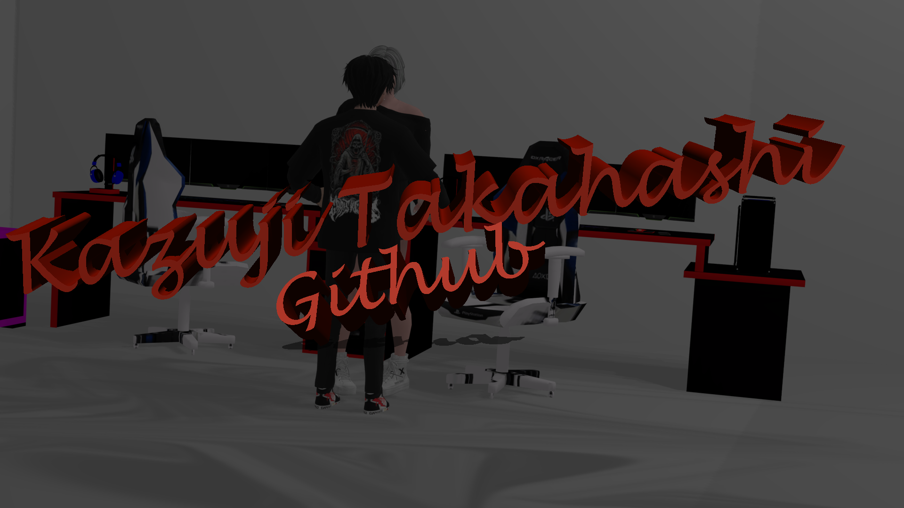

<body>

<a href=https://github.com/KzjTkshi/KzjTkshi></img></a>

Hello im Kazuji, i'm from East Java, and i'm newbie developer 

:page_with_curl: I'm currently learning

List Of My Project And Not Finished
- Replica Jogjagamers => not finished
- Replica DayZ Remastered => not finished
- Replica Lunar Pride => not finished
- Replica Revitalize => not finished
- Replica Revitalize Police Pursuit => not finished
- Replica State Of Decay Alias SOD SAMP => not finished
- Replica Arivena Theater v2.9.5c => not finished
- Replica Orang Tua Roleplay => not finished

|                                                                                       Stats                                                                                                              |                                                                                       Streaks                                                                                                             |
| -------------------------------------------------------------------------------------------------------------------------------------------------------------------------------------------------------- | --------------------------------------------------------------------------------------------------------------------------------------------------------------------------------------------------------- |
|  |  |

|                                                                                       Top Language                                                                                                       |
| -------------------------------------------------------------------------------------------------------------------------------------------------------------------------------------------------------- |
|  |
</body>

 
<!--
**KzjTkshi/KzjTkshi** is a ✨ _special_ ✨ repository because its `README.md` (this file) appears on your GitHub profile.

Here are some ideas to get you started:

- 🔭 I’m currently working on ...
- 🌱 I’m currently learning ...
- 👯 I’m looking to collaborate on ...
- 🤔 I’m looking for help with ...
- 💬 Ask me about ...
- 📫 How to reach me: ...
- 😄 Pronouns: ...
- ⚡ Fun fact: ...
-->

